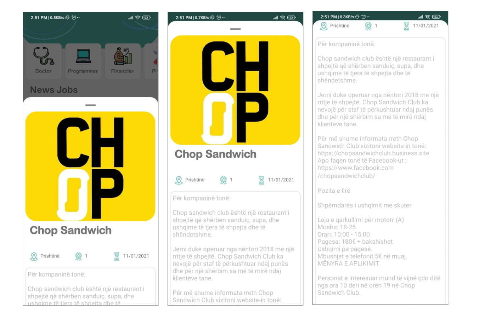

# eJobs

eJobs është aplikacion i zhilluar në platformën Android në kuadër të punimit të diplomës në nivelin bachelor në Universitetin e Prishtinës, Fakulteti i inxhinieris elektrike dhe kompjuterike.

## Përdorimi

eJobs mundëson përdoruesve të tij të kërkojn dhe të gjejn punë brenda shtetit të Kosovës, me qëllim lehtësimit e këtij procesi dhe rritjen e efikasitetit.Ky aplikacion ua ofron konkurset më të reja në treg në të gjitha fushat dhe në të gjithë sektorët e punësimit si atë privat dhe atë publik.Përvec kësaj në këtë punim mund të gjenden  dhe statistikat rreth punësimit dhe papunësimin në vendin tonë të marra nga Agjencia e Statistikave të Kosovës për vitin paraprak me qëllim të  informit të qztetarëve rreth gjendjës së punësimit në vendin tonë.

Këtu janë disa nga pamjet e aplikacionit

## Zhvilluar me

- Android Studio/Java
- Sherbimet e Firebase:
  - Firebase Auth
  - Firebase Cloude Firestore
  - Firebase Storage
- Sherbimet e Google:
  - Maps SDK for Android
  - Directions Api
  - Google SignIn
- Librari te jashtme:
  - com.ismaeldivita.chipnavigation:chip-navigation-bar:1.3.4
  - com.github.AnyChart:AnyChart-Android:1.1.2
  - com.github.bumptech.glide:glide:4.11.0
- Adobe XD

## Zhvilluar nga

- Egzonë Grashtica
